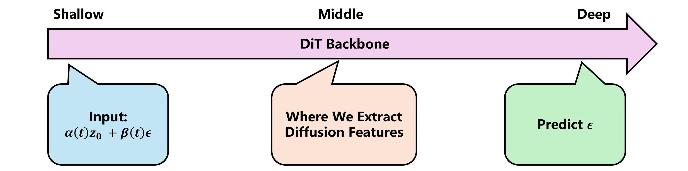
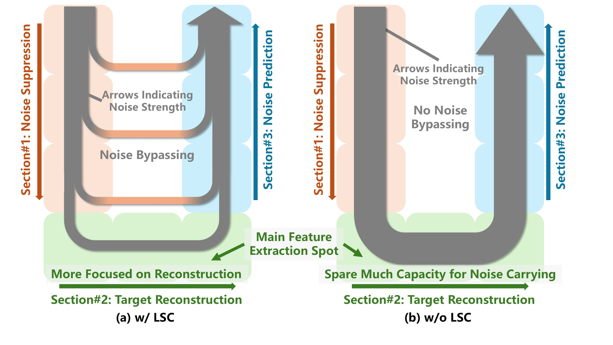
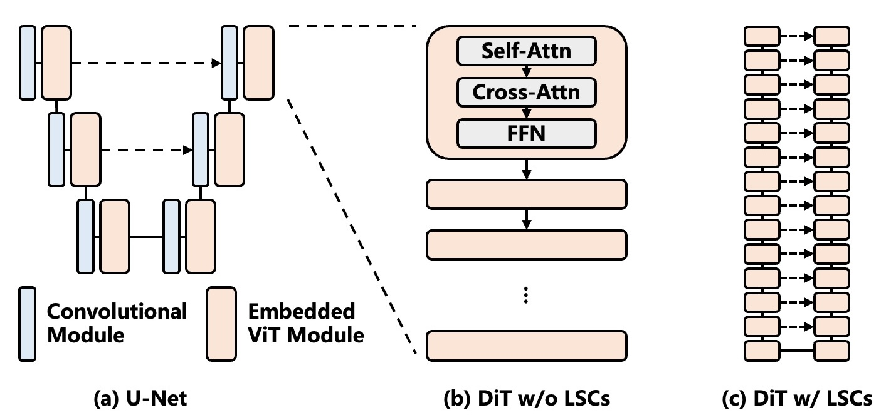

# DiT-LSC: Why DiT Models Underperform as Representation Learners without Long Skip Connections

## Why you might get interested...
Diffusion feature has been a hot research topic in recent years. The basic idea is to extract activations during a network forward call and use them as dense vision features for various vision tasks. **However, it's been hard to obtain high-quality diffusion features from DiT backbones**, despite the success in U-Net diffusion models. Want to know why? [This paper](placeholder) will provide our opinion.  

  

Check the figure above.
A key observation is that, the diffusion backbone predicts a certain target, such as noise $\epsilon$ or velocity $v$, *not* the original clean image itself.
But we know diffusion features can be used for vision tasks, indicating that they do contain information about the clean image.
Hence, diffusion features are just an *intermediate* state extracted from *middle* layers, utilized for the final prediction of the output signal in *deep* layers.
(In fact, this has inspired our [other study](https://github.com/Darkbblue/dit-compare).)

  

Furthermore, we hypothesize that, the final prediction requires two signals: the clean image *and* the input noise.
A simple example to help interpret this: to predict $\epsilon$, which is a direction telling where to move next, the backbone needs to know its current location on the denoising trajectory (provided by the input noise signal) as well as its target location (provided by the clean image signal).
Of the two signals, the clean image is the diffusion features, which form in the middle layers, while the noise signal is contained in the backbone input, and *both of them should be carried to the deep layers*.
In a standard DiT model, this means that the input noise signal needs to be carried through the entire backbone, effectively *polluting* the diffusion features extracted from middle layers.
The right part of the figure above shows this process. See how the grey arrow stays in the same width throughout?
Then, a solution would be to add *long skip connections* (LSC) to the backbone, as shown in the figure below.
They are a common and actually mandatory structure in U-Net models.
LSCs enable the noise signal to be shortcut through LSCs, leaving diffusion features cleaner and thus better.
The left part of the figure above shows this process. You can notice how the arrow becomes narrower in the middle layers.

  

We wish to point out that we are not just proposing a method to improve diffusion feature quality.
We are revealing a part of the diffusion backbone mechanism, which we believe might be more interesting.

Also, there're other studies such as [Skip-DiT](https://github.com/opensparsellms/skip-dit) and [U-ViT](https://github.com/baofff/u-vit) that show LSCs are good for diffusion *generation* as well.
We might have enough evidence to consider making LSCs a standard practice in DiT models.

## Installation
First install [generic-diffusion-feature](https://github.com/Darkbblue/generic-diffusion-feature)... then the installation is done! I guess that repo's environment already contains what most diffusion studies would need. But if you've installed that repo *before*, some update in that repo might require you to update your environment as well.

## How to run the codes
### Training
You need to prepare ImageNet first. Although the dataset may be a bit large, it serves all the DiT variants, so it's a one-time investment. Then, you can launch the training using the commands below:

```bash
# DiT
python3 dit-variants-training/DiT/train.py --model DiT-XL/2 --lsc_type "w/ LSC dense" --global-batch-size 256 --num-workers 56 --data-path /path/to/imagenet/root --results-dir /path/to/checkpoints/DiT-w --vae /path/to/sd-vae-ft-ema
# you need to replace the placeholder dirs with the actual paths you want to use
# OPTIONS:
#	--lsc_type: search for args.lsc_type in the train.py to see all the options
#	--lsc_addon: default / external-x-and-noise / external-x2-and-noise / external-x-and-noise2
#		(the three variants are for the causal intervention experiments,
#		where a '2' indicates this signal is replaced by a random signal)
#		e.g., external-x-and-noise2 uses the correct clean image but replaces the noise with a random noise

# SiT
python3 dit-variants-training/SiT/train.py --model SiT-XL/2 --lsc_type "w/o LSC" --global-batch-size 192 --use-bf16 --num-workers 56 --data-path /path/to/imagenet/root --results-dir /path/to/checkpoints/SiT-wo --vae /path/to/sd-vae-ft-ema
# you need to replace the placeholder dirs with the actual paths you want to use
# OPTIONS:
#	--lsc_type: search for args.lsc_type in the train.py to see all the options

# JiT
python3 dit-variants-training/JiT/main_jit.py --lsc_type "w/ LSC dense" --output_dir /path/to/checkpoints/JiT/w-LSC-dense --data_path /path/toimagenet/root --model JiT-L/16 --proj_dropout 0.2 --P_mean -0.8 --P_std 0.8 --img_size 256 --noise_scale 1.0 --batch_size 64 --blr 5e-5 --epochs 600 --warmup_epochs 5 --gen_bsz 64 --num_images 50000 --cfg 2.2 --interval_min 0.1 --interval_max 1.0
# you need to replace the placeholder dirs with the actual paths you want to use
# OPTIONS:
#	--lsc_type: search for args.lsc_type in the main_jit.py to see all the options
#	--lsc_addon: basic for the LSC structure in main paper and v-pred for the structure in appendix

# DiT-du
python3 dit-variants-training/DiT-du/train.py --model DiT-UNet-XL/2 --lsc_type "w/o LSC" --global-batch-size 192 --num-workers 56 --data-path /path/to/imagenet/root --results-dir /path/to/checkpoints/DiT-du --vae /path/to/sd-vae-ft-ema
# you need to replace the placeholder dirs with the actual paths you want to use
# the --lsc_type "w/o LSC" is just a placeholder and has no effect
# OPTIONS:
#	--model DiT-UNet-XL/2
#	--model DiT-UNet-XL/2-Param
#	--model DiT-UNet-XL/2 --downsample-type patch_merge --upsample-type patch_expand
#	--model DiT-UNet-XL/2-Param --downsample-type patch_merge --upsample-type patch_expand
```

### Feature on downstream tasks
First, you need to integrate your trained model checkpoints into the generic-diffusion-feature framework. You can search `'dit'`, `'dit-v'`, `'jit'`, `'dit-du'` in `generic-diffusion-feature/feature-components/models.py` to locate the corresponding codes. All the codes are ready, and you only need to replace the checkpoint paths with your checkpoints.  

Then, you can launch the downstream feature evaluation with the commands below:
```bash
# SPair (a)
python3 generic-diffusion-feature/correspondence/task-corres.py --log_path /path/to/logs/dit_feature/dit/ --dataset_path /path/to/SPair-71k/JPEGImages/ --configs generic-diffusion-feature/feature/configs/dits/config_dit_w_lsc_dense.json --task_name exp1 --algorithm nn

# SPair (b)
python3 generic-diffusion-feature/correspondence/task-corres.py --log_path /path/to/logs/dit_feature/dit/ --dataset_path /path/to/SPair-71k/JPEGImages/ --configs generic-diffusion-feature/feature/configs/dits/config_dit_w_lsc_dense.json --task_name exp1 --algorithm conv

# SPair (c)
python3 generic-diffusion-feature/correspondence/task-corres.py --train_diffusion --lr 1e-4 --log_path /path/to/logs/dit_feature/dit/ --dataset_path /path/to/SPair-71k/JPEGImages/ --configs generic-diffusion-feature/feature/configs/dits/config_dit_w_lsc_dense.json --task_name exp1 --algorithm nn --g_loss_mult 0

# Horse-21
# first extract features:
python3 generic-diffusion-feature/extract_feature.py --img_size 256 --layer generic-diffusion-feature/feature/configs/dits/config_dit_w_lsc_dense_scarce.json --version "dit w/ lsc" --batch_size 1 --t 50 --aggregate_output --input_dir "/path/to/horse_21/real/train/*.png" --prompt_file generic-diffusion-feature/prompt.txt --output_dir /path/to/outputs/dit-feature-dit-v-w/horse_21/ --split train
python3 generic-diffusion-feature/extract_feature.py --img_size 256 --layer generic-diffusion-feature/feature/configs/dits/config_dit_w_lsc_dense_scarce.json --version "dit w/ lsc" --batch_size 1 --t 50 --aggregate_output --input_dir "/path/to/horse_21/real/test/*.png" --prompt_file generic-diffusion-feature/prompt.txt --output_dir /path/to/outputs/dit-feature-dit-v-w/horse_21/ --split test
# then run the downstream task
python3 generic-diffusion-feature/scarce_segmentation/task-pixel.py --category horse_21 --dataset_path /path/to/horse_21/real/ --log_path /path/to/logs/dit_feature/dit/w/ --feature_path /path/to/outputs/dit-feature-dit-v-w --feature_id horse_21 --feature_len 3456 --task_name selection --batch_size 64

# City
python3 generic-diffusion-feature/segmentation/train.py generic-diffusion-feature/segmentation/configs/city_dit.py --work-dir /path/to/logs/mmseg/city_dit

# Depth
python3 generic-diffusion-feature/depth/main.py --train_backbone --output_dir /path/to/logs/depth/dit-w --config generic-diffusion-feature/feature/configs/dits/config_dit_w_lsc_dense.json --data_path /path/to/nyu_depth_v2/data_converted --epochs 1
```

You can see all the configs available in generic-diffusion-feature/feature/configs, including those large-scale open-source t2i DiTs. I've synchronized them into that repo.  

In addition, to reproduce our massive activation suppression experiment, you can replace the feature ids in a config file with `vit-blockxxx-out-ma`. But only DiT models support massive activation suppression.

### Feature probing
For mutual information probing: You need to first sample some hundred-ish images from any dataset. In the example below I choose ImageNet since it's already on the disk. For the results in the paper, we used DiffusionDB (PixArt-Sigma). Then, run:
```bash
python3 generic-diffusion-feature/extract_feature_per_prompt.py --layer generic-diffusion-feature/feature/configs/dits/config_dit_mi.json --version "dit w/ lsc" --img_size 256 --batch_size 1 --t 500 --input_dir "/path/to/imagenet/probing/*.JPEG" --output_dir /path/to/mi/dit-w/ --use_original_filename --sample_name_first

python3 generic-diffusion-feature/mutual_information/main.py --N 1000 --feat_root "/path/to/mi/dit-w/*" --layers generic-diffusion-feature/feature/configs/dits/config_dit_mi.json --img_root /path/to/imagenet/probing
```

For correlation decay slope:
```bash
python3 correlation_decay_slope.py --image_dir /path/to/imagenet/linear_probing/test --version "dit w/ lsc" --output /path/to/probing/cds/w-part1.json --layer vit-block2-out vit-block4-out vit-block6-out vit-block8-out vit-block10-out vit-block12-out vit-block14-out

python3 correlation_decay_slope.py --image_dir /path/to/imagenet/linear_probing/test --version "dit w/ lsc" --output /path/to/probing/cds/w-part1.json --layer vit-block16-out vit-block18-out vit-block20-out vit-block22-out vit-block24-out vit-block26-out
```

For linear probing:
```bash
python3 linear_probing.py --version "dit w/ lsc" --t 50 --cache_dir /path/to/linear_probing/cache-dit-w-t50 --data_dir /path/to/imagenet/linear_probing/ --layer vit-block1-out vit-block3-out vit-block5-out vit-block7-out vit-block9-out vit-block11-out vit-block13-out vit-block15-out vit-block17-out vit-block19-out vit-block21-out vit-block23-out vit-block25-out vit-block27-out --t 50 --target_layer pipe-x0 --out_channels 4
# OPTIONS: target_layer could also be set to pipe-gt
```

### Generation evaluation
DiT, SiT, and DiT-du checkpoints use the same generation evaluation pipeline. You need to download an npz file precomputed from imagenet, which I believe can be found in the torch-fidelity repo or by following DiT repo instructions.
```bash
python3 dit-variants-training/DiT/sample_ddp.py --model DiT-XL/2 --lsc_type "w/ LSC dense" --sample-dir /path/to/outputs/dit-generation/w-LSC --ckpt /path/to/checkpoints/DiT-256/001-DiT-XL-2-w_-LSC-dense/checkpoints/0400000.pt --per-proc-batch-size 48 --cfg-scale 1 --vae /path/to/sd-vae-ft-ema
# for SiT, add ODE before all the other arguments. e.g., python3 sample_ddp.py ODE --model SiT-XL/2 ...

python3 dit-variants-training/DiT/evaluator.py /path/to/imagenet/root/VIRTUAL_imagenet256_labeled.npz /path/to/outputs/dit-generation/w-LSC/sd-vae-ft-ema-cfg-1.0-seed-0.npz
```

JiT evaluation is done in a different way:
```bash
python3 dit-variants-training/JiT/main_jit.py --lsc_type "w/ LSC dense" --output_dir /path/to/JiT-new/w-LSC-dense-vpred/gen-30  --resume /path/to/jit-w/checkpoint-30.pth --model JiT-L/16 --img_size 256 --noise_scale 1.0 --gen_bsz 256 --num_images 10000 --cfg 2.4 --interval_min 0.1 --interval_max 1.0 --data_path /path/to/imagenet/root --evaluate_gen
```

## Citation
When mentioning this study, it wants to be named as *DiT-LSC*.
Bib is still in preparation, as it's weekend and arXiv volunteers are not working now.
